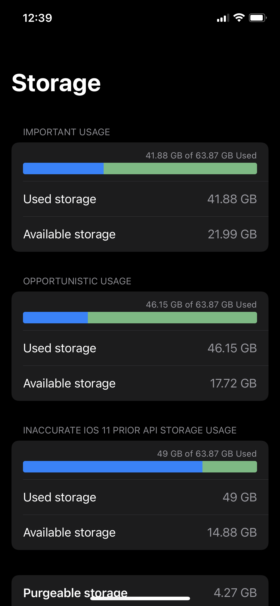
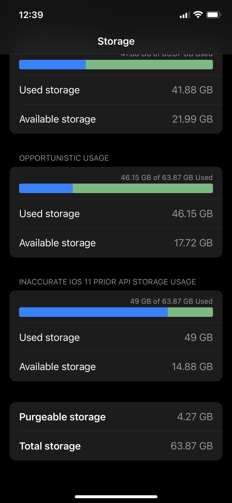
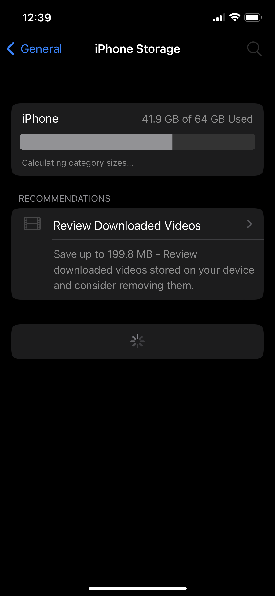

# DiskSpaceProvider

A mini project exploring available API's to check Disk Storage Capacity

## Accessing total disk size of the device

```swift
let homeDirectoryPath = NSHomeDirectory() as String
let systemAttributes = try FileManager.default.attributesOfFileSystem(forPath: homeDirectoryPath)
let spaceInBytes = (systemAttributes[FileAttributeKey.systemSize] as? NSNumber)?.int64Value
```

For getting the total disk size of device `Foundation` framework contains `attributesOfFileSystem(forPath:)` function in `FileManager` class which returns a dictionary that describes the attributes of the mounted file system on which a given path (home) resides which is the only disk of iOS/iPadOS Devices, in that dictionary we can find the disk total size, using `FileAttributeKey.systemSize` key this contains a numberic value which then can be typecasted to `NSNumber` and `.int64Value` property of `NSNumber` can be used to get the byte size.

## Accessing used disk size of the device

We have 2 APIs to access the used disk size in iOS

- Using FileManager API
- Using URL API

> **Warning:**
> Using FileManager API result inaccurate size, this should only be used in case URL API is not available that is below iOS 11

### Using FileManager API

```swift
let homeDirectoryPath = NSHomeDirectory() as String
let systemAttributes = try FileManager.default.attributesOfFileSystem(forPath: homeDirectoryPath)
let freeSpaceInBytes = (systemAttributes[FileAttributeKey.systemFreeSize] as? NSNumber)?.int64Value
```

The implementation is pretty similar to accessing the used disk size of the device, the only this that is changed is the  FileAttributeKey rather than using `systemSize` key which corresponds to the total size of disk we used `systemFreeSize` which corresponds to disk available size the value is determined by statfs() which can be sometimes inaccurate for iOS file systems.

> This works fine for macOS though

### Using URL API

URL class provides us a method `resourceValues(forKeys:)` which accepts `URLResourceKey`, in iOS 11 and above we two keys which corresponds to free/available storage, used to check disk availability according to the importance of file we want to store on disk
 - `URLResourceKey.volumeAvailableCapacityForImportantUsageKey`: corresponds to the volume’s available capacity in bytes for storing important resources, this yeild exact values as what we see in iPhone Storage Setting page.
 - `URLResourceKey.volumeAvailableCapacityForOpportunisticUsageKey`: corresponds to the volume’s available capacity in bytes for storing nonessential resources.


#### Important Usage

```swift
let homeDirectoryUrl = URL(fileURLWithPath: NSHomeDirectory() as String)
let resourceKey = URLResourceKey.volumeAvailableCapacityForImportantUsageKey
let resourceValues = try homeDirectoryUrl.resourceValues(forKeys: [resourceKey])
let usedSizeInBytes = resourceValues.volumeAvailableCapacityForImportantUsage
```

#### Opportunistic Usage

```swift
let homeDirectoryUrl = URL(fileURLWithPath: NSHomeDirectory() as String)
let resourceKey = URLResourceKey.volumeAvailableCapacityForOpportunisticUsageKey
let resourceValues = try homeDirectoryUrl.resourceValues(forKeys: [resourceKey])
let usedSizeInBytes = resourceValues.volumeAvailableCapacityForOpportunisticUsage
```

For getting the free space we create a URL to the home directory and fetch the resourceValues for the URL, using the required URLResourceKey, then we access corresponding size value, `URLResourceValues` contains `volumeAvailableCapacityForImportantUsage` and `volumeAvailableCapacityForOpportunisticUsage` property whose value gets fetched according to passed URLResourceKey, otherwise returns nil, both of the properties are Int64 and represents the size in bytes.

# Demo App

|Disk Size|Total and Purgeable Size|iPhone Storage|
|---|---|---|
||||
